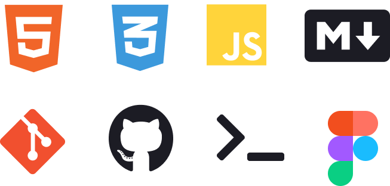

<h1 align="center">Hey Hola! 🙌 Mi nombre Gabriel Vit </h1>
<h2 align="center">Soy un jovén aspirante a ser <b>  Desarrollador Web FrontEnd 👨‍💻</b> Ubicado en la Ciudad de Guatemala</h2>

# Mis Redes Sociales

# Mis Conocimientos 

# Formación
Todos mis conocimientos los he obtenido gracias a alugnos cursos de la Escuela Digital [ED Team](https://ed.team/) y video cursos de [Jonathan Mircha](http://jonmircha.com/) (Profesor y Programador web)  